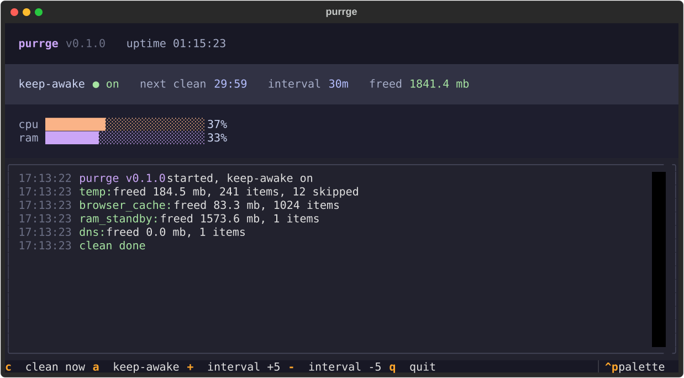
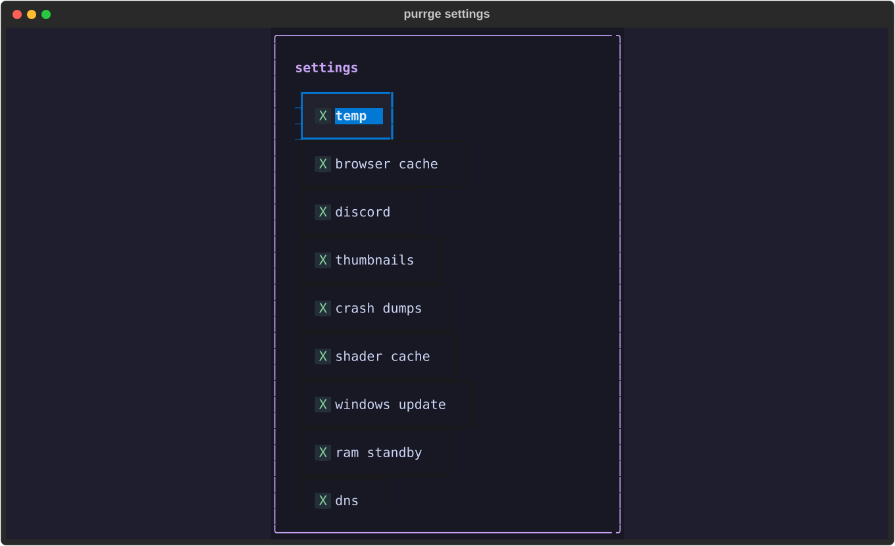

<div align="center">

# 😼 purrge

**keeps your pc awake. purges the junk. looks good doing it.**


<br><br>



</div>

---

## what is this

purrge is a single-exe terminal dashboard for windows that does two things, forever, quietly:

1. **keeps the machine awake** — it tells windows "no sleep, no display-off" through the official `SetThreadExecutionState` api. no mouse-jiggling, no fake keypresses, no dummy video playing in a corner. flip it off any time with one key.
2. **purges junk on a schedule** — every 30 minutes (tune it from 5 to 240) it sweeps the stuff that quietly piles up and drags a long-running machine down, then tells you exactly how much it freed.

it's built for machines that stay on: download rigs, home servers, rdp boxes, that laptop in the corner running things overnight.

## the cleaners

| cleaner | what it does | what it never touches |
| --- | --- | --- |
| 🗑️ **temp** | sweeps `%TEMP%` and `c:\windows\temp`, files older than 1 hour | anything locked or in use, `_mei*` dirs of running apps |
| 🌐 **browser cache** | chrome, edge and firefox cache folders — only while that browser is closed | history, cookies, passwords, sessions |
| 💬 **discord** | discord's cache, code cache and gpu cache — only while discord is closed | your messages, settings, login |
| 🖼️ **thumbnails** | explorer's `thumbcache_*.db` / `iconcache_*.db` files | any actual image or file |
| 💥 **crash dumps** | windows error reporting queues and archives | live dumps being written |
| 🎮 **shader cache** | directx and nvidia shader caches older than 1 hour | caches in active use |
| 🔄 **windows update** | leftover update downloads in `softwaredistribution\download` (admin) | installed updates |
| 🧠 **ram standby** | purges the standby memory list so active apps get fresh ram (admin) | anything a running process owns |
| 📡 **dns** | flushes the resolver cache | your network settings |

every run is reported in the log with freed mb, item counts and skips. a cleaner that fails just logs and steps aside — it can never crash the app or block the others.

<div align="center">
<br>

<br><br>
</div>

## controls

everything is clickable — buttons for clean / awake / settings / tray, checkboxes in settings. or use the keys:

| key | action |
| :---: | --- |
| `c` | clean now, don't wait for the timer |
| `a` | toggle keep-awake on/off |
| `s` | settings — toggle each cleaner, change the interval |
| `h` | hide to the system tray (the cat icon brings it back) |
| `+` / `-` | clean interval +5 / −5 minutes (saved instantly) |
| `q` | quit — power settings go back to normal |

## headless mode

`purrge clean` runs every enabled cleaner once, prints a summary table and exits — no dashboard. perfect for task scheduler jobs and servers:

```console
purrge clean
```

## get it

grab `purrge.exe` from the [latest release](../../releases/latest) and run it. that's the whole install.

windows asks for admin once at launch — that's what the ram standby purge needs. everything else works without it; if you deny elevation, that cleaner just reports itself skipped.

works on windows 10, windows 11 and windows server 2016+. on a server over rdp: disconnect (don't sign out) and purrge keeps running.

## run from source

```console
git clone https://github.com/ege0x77czz/purrge
cd purrge
pip install -e .
python -m purrge
```

## build your own exe

```console
pip install -e .[dev]
pyinstaller --onefile --name purrge --uac-admin --collect-submodules textual --hidden-import pystray._win32 entry.py
```

or just push a `v*` tag — github actions builds the exe on a windows runner and attaches it to a release.

## config

lives at `%APPDATA%\purrge\config.json`, edited live from the dashboard or by hand:

```json
{
  "interval_minutes": 30,
  "cleaners": {
    "temp": true,
    "browser_cache": true,
    "discord": true,
    "thumbnails": true,
    "crash_dumps": true,
    "shader_cache": true,
    "windows_update": true,
    "ram_standby": true,
    "dns": true
  },
  "total_freed_bytes": 0
}
```

`total_freed_bytes` is your all-time counter — purrge shows it in the header and keeps growing it across sessions.

## design notes

- catppuccin mocha everywhere: base `#1e1e2e`, mauve `#cba6f7`, green `#a6e3a1`, peach `#fab387`, red `#f38ba8`
- the temp sweeper skips anything younger than an hour and anything windows says is in use, so it cannot eat a file some app is mid-write on
- exiting purrge always restores normal power behavior, even on ctrl+c
